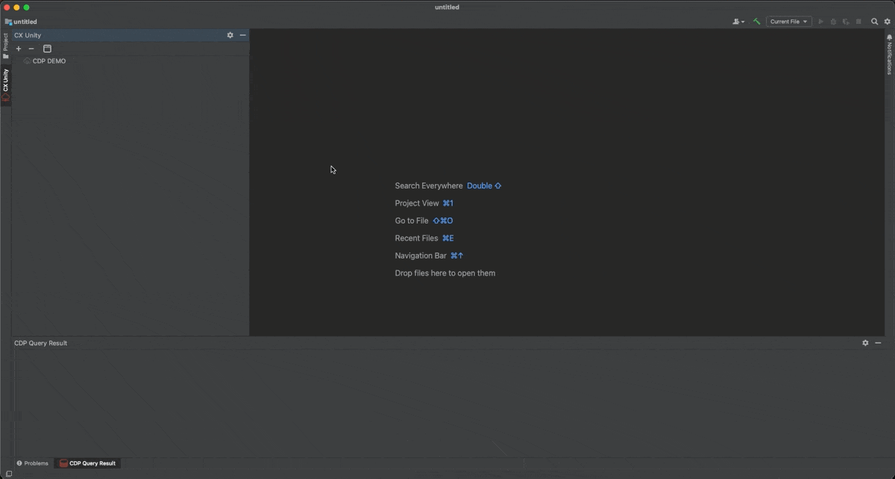
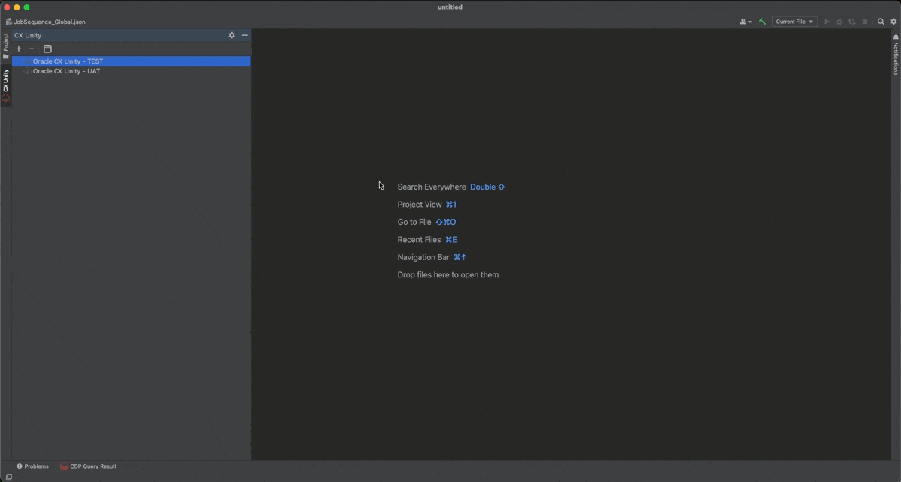
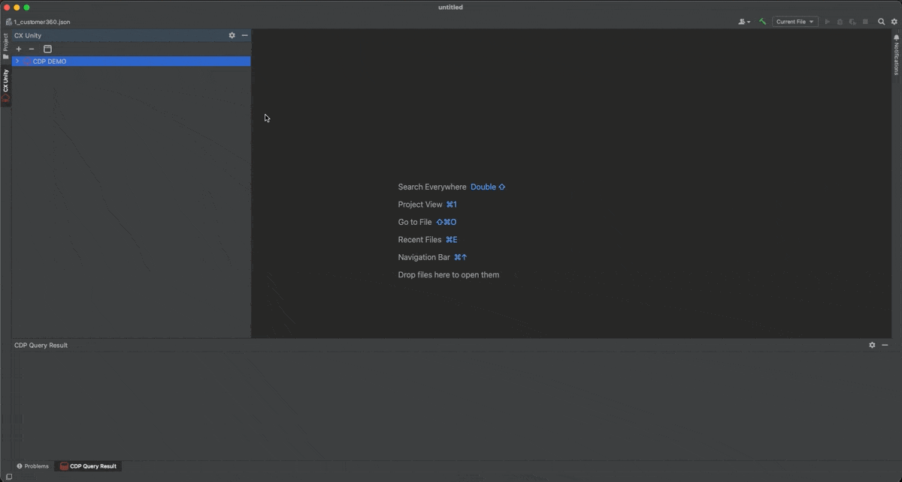
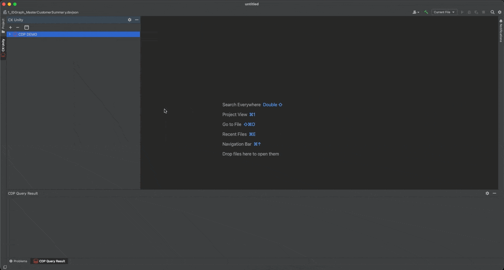
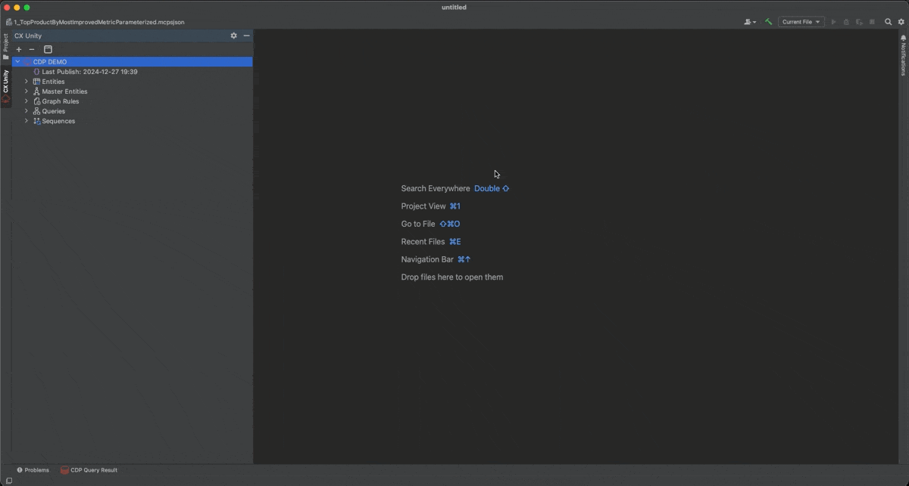

# Oracle CDP - CX Unity Navigator IntelliJ

Welcome to the unofficial Oracle CDP CX Unity plugin for the Jetbrains Platform

The Couchbase JetBrains plugin provides support for Couchbase in JetBrains IDEs.

## Installation (TBD)

- Using IDE built-in plugin system:

  <kbd>Preferences</kbd> > <kbd>Plugins</kbd> > <kbd>Marketplace</kbd> > <kbd>Search for "ocdp"</kbd> >
  <kbd>Install Plugin</kbd>

# Quick Tour

## Plugin View configurations

<kbd>View</kbd> > <kbd>Tool Windows</kbd> > <kbd>CX Unity</kbd>

## Tenant

### Add Tenant Connection

To connect to a CX Unity tenant, follow these steps:

1. Click on the "Add" icon.
2. Complete all the required fields with the necessary details.
3. Finally, click on the "OK" button to establish a connection to the tenant.

> **_NOTE:_** If you test the connection click on "Test Connection", which helps you to identify potential problems with your connection.

### Connect, Disconnect or Delete a connection

Right-click on the connection to open the context menu, you will be able to choose between options to Connect and Disconnect.

You can delete tenant configuration from "-" icon in the navigation bar.

Click on the tenant to see the list of items to explore.

## Explorer

### Entities

You can see all active Entities (Table) configured. Properties and fields.

 

### Master Entities & Intelligent Attributes

You can see all Master Entities (Aggregated Table) configured with Intelliget Attribute active\inactive. Right-click or Double-click on the Intelligent Attribute to review configuration.

You can test Intelligent Attribute with "Run" icon in the editor and review the result in "CX Unity Query Result" view.

### API 360 (Customer 360)

You can see Graph Rules configured. Right-click or Double-click on the related Datasourceview to review configuration.

You can test Datasourceviews with "Run" icon in the editor and review the result in "CX Unity Query Result" view.

### Queries

You can see Segments configured. Right-click or Double-click on the related Segment to review configuration.

You can test Segment with "Run" icon in the editor and review the result in "CX Unity Query Result" view.

> **_NOTE:_** You can modify Json but no update will be pushed on CDP. Click on "Edit on CDP" to open "Segment Builder" on CX Unity.

### Sequences

You can see Sequence configured.

> **_NOTE:_** You can modify Json but no update will be pushed on CDP.

## DevOps

1. You can migrate entities between tenants. (TBD)
2. You can migrate Segments between tenants. (TBD)
3. You can migrate Ingest and Export jobs between tenants. (TBD)

# Plugin Development

This project is not officially supported by Oracle, but it is actively maintained by myself. So if you find any bugs/issues or would like to suggest anything, feel free to open an issue here on github.
